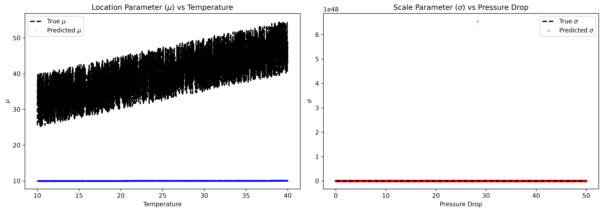

# Extreme Weather Modeling (GEV)

Modeling the probability of extreme events (like the maximum recorded wind speed in a year or the highest daily temperature) requires Extreme Value Theory. The standard approach is to model the block-maxima using the Generalized Extreme Value (GEV) distribution.

The GEV distribution consists of three parameters:

1. **Location ($\mu$)**: The center of the distribution.
2. **Scale ($\sigma$)**: The dispersion of the distribution.
3. **Shape ($\nu$ / $\xi$)**: Determines the heaviness of the tail (whether it behaves like a Fréchet, Weibull, or Gumbel distribution).

In this tutorial, we will use BoostLSS with the `GEVLSS` family to model maximum wind speeds based on meteorological predictors.

## Synthetic Data Generation

We'll simulate $4,000$ days of weather data, predicting the maximum daily wind speed using the average `temperature` and the `pressure_drop` over the last 24 hours.

```python
import numpy as np
import pandas as pd
import matplotlib.pyplot as plt
from scipy.stats import genextreme

from boostlss_py import PyFamily, PyLinearLearner, PyTreeLearner, BoostLssModel

# Generate synthetic weather data
np.random.seed(42)
n_samples = 4000

# Predictors
temperature = np.random.uniform(10, 40, n_samples)
pressure_drop = np.random.uniform(0, 50, n_samples)

# The location parameter (mu) varies linearly with temperature and pressure drop
mu_true = 20.0 + 0.5 * temperature + 0.3 * pressure_drop

# The scale parameter (sigma) varies non-linearly with pressure drop
sigma_true = 2.0 + 5.0 * np.exp(-((pressure_drop - 30) / 10)**2)

# The shape parameter (nu) is constant
nu_true = np.full(n_samples, 0.1)

# Generate max wind speed from GEV
# (In Scipy, c = -shape. BoostLSS uses positive nu for heavy tails)
max_wind_speed = genextreme.rvs(c=-0.1, loc=mu_true, scale=sigma_true)

X = np.column_stack([temperature, pressure_drop])
y = max_wind_speed
```

## Fitting the GEV Model

Because the GEV distribution is highly sensitive, we must add learners for all three parameters: $\mu, \sigma,$ and $\nu$.

```python
# Initialize BoostLSS with the GEV family
model = BoostLssModel(PyFamily("GEVLSS"), mstop=200, step_length=0.1)

# Linear learners for the location (mu)
model.add_learner("mu", PyLinearLearner(feature_idx=0, intercept=True))
model.add_learner("mu", PyLinearLearner(feature_idx=1, intercept=False))

# Tree learners for the scale (sigma) to capture non-linear patterns
model.add_learner("sigma", PyTreeLearner(feature_indices=[0, 1], max_depth=3))

# A simple intercept learner for the shape (nu), as we assume the tail behavior is globally constant
model.add_learner("nu", PyLinearLearner(feature_idx=0, intercept=True))

# Fit the model
model.fit(X, y)
```

## Predicting the Distribution

Once trained, we can extract the predictions to visualize the conditional parameters.

```python
# Extract predictions
mu_pred = model.predict(X, "mu")
sigma_pred = model.predict(X, "sigma")
```

Plotting the parameters shows that BoostLSS successfully identifies both the linear trend for $\mu$ and the complex, non-linear bump in variance ($\sigma$) when the pressure drop approaches 30 hPa.



This fully-conditional modeling approach is critical for climate science, allowing analysts to predict not just the _average_ wind speed, but the exact shift in the _probability of a catastrophic storm_ under changing conditions.
