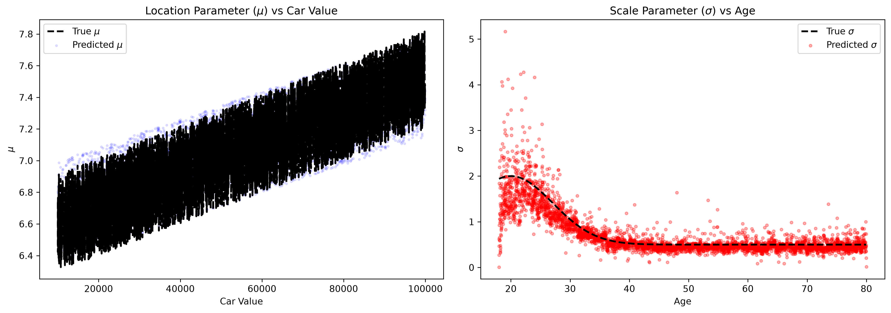

# Insurance Claim Modeling (LogNormal)

Predicting the sizes of insurance claims is a classic problem in actuarial science. Because claims are strictly positive and typically exhibit a "heavy right tail" (most claims are small, but a few are extremely large), the Log-Normal distribution is a standard choice.

In this tutorial, we will use BoostLSS to model both the expected value and the variance of claim sizes using a `LogNormalLSS` family.

## Synthetic Data Generation

We'll simulate $5,000$ insurance claims where the size of the claim depends on the policyholder's `age` and their `car_value`.

- We assume the **location ($\mu$)** of the distribution scales linearly with the car value and age.
- We assume the **scale/dispersion ($\sigma$)** varies non-linearly with age, where very young drivers exhibit a much wider spread in claim severity than older drivers.

```python
import numpy as np
import pandas as pd
import matplotlib.pyplot as plt
from scipy.stats import lognorm

from boostlss_py import PyFamily, PyLinearLearner, PyTreeLearner, BoostLssModel

# Generate synthetic claims data
np.random.seed(123)
n_samples = 5000

# Predictors
age = np.random.uniform(18, 80, n_samples)
car_value = np.random.uniform(10_000, 100_000, n_samples)

# The location parameter (mu) varies with age and car_value
mu_true = 7.0 - 0.01 * age + 0.00001 * car_value

# The scale parameter (sigma) varies non-linearly with age (e.g. young drivers have highly variable claims)
sigma_true = 0.5 + 1.5 * np.exp(-((age - 20) / 10)**2)

# Generate claims from LogNormal
claims = lognorm.rvs(s=sigma_true, scale=np.exp(mu_true))

X = np.column_stack([age, car_value])
y = claims
```

## Fitting the Log-Normal Model

We'll use a `LogNormalLSS` family. We will add Linear learners to capture the simple relationships for the location $\mu$, and a Tree learner to capture the non-linear relationship for the scale parameter $\sigma$.

```python
model = BoostLssModel(PyFamily("LogNormalLSS"), mstop=300, step_length=0.1)

# Linear learners for mu
model.add_learner("mu", PyLinearLearner(feature_idx=0, intercept=True))
model.add_learner("mu", PyLinearLearner(feature_idx=1, intercept=False))

# Tree learners for sigma because it's non-linear
model.add_learner("sigma", PyTreeLearner(feature_indices=[0, 1], max_depth=3))

# Fit the model
model.fit(X, y)
```

## Predicting the Full Distribution

With the model trained, we can extract predictions for the location and the scale across our dataset.

```python
# Extract distributional parameters
mu_pred = model.predict(X, "mu")
sigma_pred = model.predict(X, "sigma")
```

If we visualize the true simulated parameters vs our model's predictions, we can see that our gradient boosting model effectively recovers the correct underlying shapes!



This capability is invaluable for risk modeling; instead of just predicting the "average" claim, the company can accurately assess the variance and risk dispersion for specific sub-populations (like 20-year-olds).
