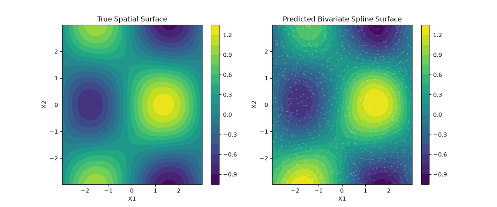

# Spatial Regression with Bivariate Splines

When working with spatial data (like latitude and longitude) or any two continuous variables with complex interactions, independent univariate splines are often insufficient. `boostlss` provides the `PyBivariatePSplineLearner` to construct tensor-product splines, allowing the model to capture smooth, two-dimensional interaction surfaces.

This end-to-end example demonstrates how to model a 2D spatial surface, such as predicting temperature or housing prices based on coordinates.

## 1. Setup and Data Generation

We'll generate a synthetic spatial dataset where the target variable $y$ follows a non-linear "peaks and valleys" surface across two dimensions, $X_1$ and $X_2$.

```python
import numpy as np
import matplotlib.pyplot as plt
from boostlss_py import PyFamily, PyBivariatePSplineLearner, BoostLssModel

# 1. Generate grid of coordinates
np.random.seed(42)
n_samples = 1000

# Random coordinates in a [-3, 3] x [-3, 3] space
x1 = np.random.uniform(-3, 3, size=n_samples)
x2 = np.random.uniform(-3, 3, size=n_samples)

# Combine into design matrix
X = np.column_stack([x1, x2])

# 2. Define a true spatial surface function
def true_surface(x1, x2):
    # A complex surface with peaks and valleys
    return np.sin(x1) * np.cos(x2) + 0.5 * np.exp(-(x1**2 + x2**2) / 4)

# 3. Generate response with Gaussian noise
true_mu = true_surface(x1, x2)
# Heteroscedastic variance: higher variance where x1 is positive
true_sigma = 0.1 + 0.2 * (x1 > 0)

y = np.random.normal(loc=true_mu, scale=true_sigma)
```

## 2. Model Initialization

We'll use a `GaussianLSS` family. We want to model _both_ the mean (`mu`) and the variance (`sigma`) as spatial surfaces.

```python
# Initialize the model with cyclic algorithm
family = PyFamily("GaussianLSS")
model = BoostLssModel(family, mstop=300, step_length=0.1)

# Add Bivariate Splines for both parameters
# We specify the indices of the two interacting features (0 and 1)
model.add_learner("mu", PyBivariatePSplineLearner(
    feature1_idx=0,
    feature2_idx=1,
    df=6.0  # Slightly higher df for a more flexible 2D surface
))

model.add_learner("sigma", PyBivariatePSplineLearner(
    feature1_idx=0,
    feature2_idx=1,
    df=4.0  # Lower df for variance to prevent overfitting the noise
))

# Fit the model
print("Fitting spatial model...")
model.fit(X, y)
print("Done.")
```

## 3. Prediction and Visualization

To visualize what the model learned, we'll generate a dense grid over the $[-3, 3]$ space, predict the $\mu$ parameter, and compare it to the true surface.



```python
# 1. Create a dense grid for plotting
grid_x1, grid_x2 = np.meshgrid(
    np.linspace(X[:, 0].min(), X[:, 0].max(), 50),
    np.linspace(X[:, 1].min(), X[:, 1].max(), 50)
)
grid_X = np.column_stack([grid_x1.ravel(), grid_x2.ravel()])

# 2. Predict using the trained model
pred_mu = model.predict(grid_X, "mu")
pred_mu_grid = pred_mu.reshape(grid_x1.shape)

# True surface on the grid
true_mu_grid = true_surface(grid_x1, grid_x2)

# 3. Plotting (Requires matplotlib)
fig, (ax1, ax2) = plt.subplots(1, 2, figsize=(12, 5))

# Plot True Surface
c1 = ax1.contourf(grid_x1, grid_x2, true_mu_grid, levels=20, cmap='viridis')
ax1.set_title("True Spatial Surface")
ax1.set_xlabel("X1")
ax1.set_ylabel("X2")
fig.colorbar(c1, ax=ax1)

# Plot Predicted Surface
c2 = ax2.contourf(grid_x1, grid_x2, pred_mu_grid, levels=20, cmap='viridis')
ax2.scatter(x1, x2, c='white', s=1, alpha=0.2) # overlay data points
ax2.set_title("Predicted Bivariate Spline Surface")
ax2.set_xlabel("X1")
ax2.set_ylabel("X2")
fig.colorbar(c2, ax=ax2)

plt.tight_layout()
plt.show()
```

### Key Takeaways

- The `PyBivariatePSplineLearner` handles the complex tensor-product math under the hood.
- By tuning the `df` argument separately for `mu` and `sigma`, we avoided overfitting the variance surface while keeping the mean surface flexible enough to capture the complex shape.
