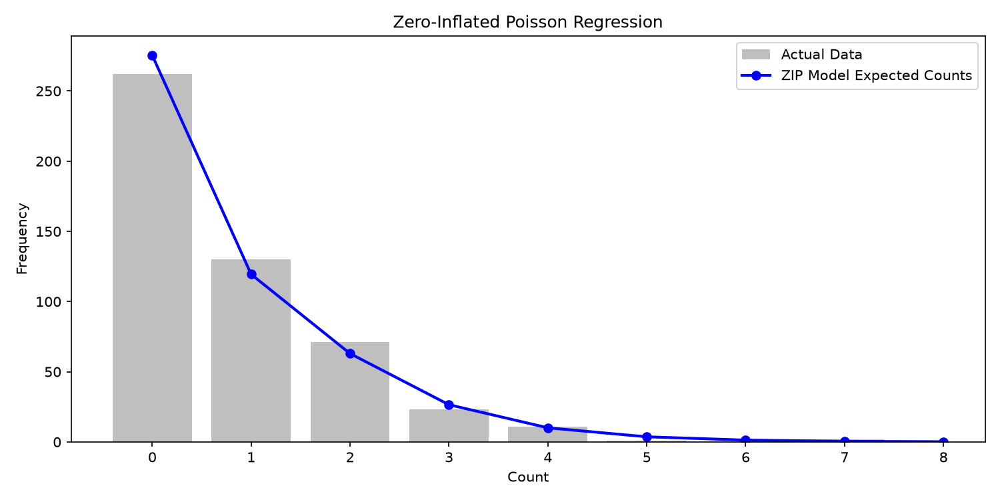

# Zero-Inflated Poisson (ZIP) Regression

When modeling count data (e.g., number of hospital visits, insurance claims, or product defects), standard Poisson regression is often inadequate if the dataset contains an excess of structural zeros. The **Zero-Inflated Poisson (ZIP)** model addresses this by blending two processes:

1. A logistic regression process that predicts whether an observation is a "structural zero".
2. A standard Poisson process that predicts the counts for the non-structural zeros.

`boostlss` natively supports `PyFamily("ZIPLSS")`, meaning you can model both the Poisson mean (`mu`) and the zero-inflation probability (`sigma`) simultaneously, even applying different features and learners to each process.

## 1. Setup and Data Generation

We'll generate synthetic count data where the actual counts depend on feature `X_0`, but there is a structural zero-inflation process that depends heavily on feature `X_1`. To demonstrate `boostlss`'s native support for high-dimensional sparse data, we will run the model directly on a SciPy CSR Sparse matrix.

```python
import numpy as np
import matplotlib.pyplot as plt
import scipy.sparse as sp
from boostlss_py import PyFamily, PyLinearLearner, BoostLssModel

# Generate count data with excess zeros
np.random.seed(42)
X = np.random.normal(size=(500, 2))
# Convert to a sparse matrix to demonstrate sparse support
X_sparse = sp.csr_matrix(X)

# True lambdas and zero-inflation probabilities
true_lambda = np.exp(0.5 * X[:, 0])
true_pi = 1 / (1 + np.exp(-1 * (X[:, 1] - 1)))  # Logit link

y = np.random.poisson(true_lambda)
# Inflate with zeros
is_zero = np.random.binomial(1, true_pi)
y[is_zero == 1] = 0
```

## 2. Fitting the ZIP Model

We initialize `PyFamily("ZIPLSS")` and assign linear learners to both the mean process and the zero-inflation probability process.

```python
# Initialize ZIP model
# ZIP models "mu" (poisson mean) and "sigma" (zero-inflation probability)
family = PyFamily("ZIPLSS")
model = BoostLssModel(family, mstop=200, step_length=0.1)

# Add linear learners
model.add_learner("mu", PyLinearLearner(0))
model.add_learner("sigma", PyLinearLearner(1))

# Fit directly on the sparse matrix!
model.fit(X_sparse, y)

# Predict lambda and pi
mu_pred = model.predict(X_sparse, "mu")
sigma_pred = model.predict(X_sparse, "sigma")
```

## 3. Visualizing the Expected Distribution

To prove the model has accurately captured both the zero-inflation and the Poisson process, we can plot the expected frequencies of counts based on our predictions against the actual observed histogram.



```python
# Plot the distribution of true counts vs predicted counts
plt.figure(figsize=(10, 5))
plt.hist(y, bins=range(0, int(max(y))+1), alpha=0.5, label='Actual Data', color='grey', align='left', rwidth=0.8)

# Calculate expected count frequencies
expected_counts = np.zeros(int(max(y))+1)
for i in range(len(y)):
    lam = mu_pred[i]
    pi = sigma_pred[i]
    for k in range(len(expected_counts)):
        if k == 0:
            prob = pi + (1 - pi) * np.exp(-lam)
        else:
            prob = (1 - pi) * (np.exp(-lam) * lam**k) / np.math.factorial(k)
        expected_counts[k] += prob

plt.plot(range(0, int(max(y))+1), expected_counts, 'bo-', label='ZIP Model Expected Counts', linewidth=2)
plt.title("Zero-Inflated Poisson Regression")
plt.xlabel("Count")
plt.ylabel("Frequency")
plt.xticks(range(0, int(max(y))+1))
plt.legend()
plt.tight_layout()
plt.show()
```

### Key Takeaways

- Using `ZIPLSS` automatically instantiates two link functions: an exponential link to ensure the Poisson mean (`mu`) is strictly positive, and a logit link to ensure the zero-inflation probability (`sigma`) is between 0 and 1.
- We successfully identified the spike at $0$ counts without dragging the expected lambda of the non-zero counts downwards.
- The `boostlss` engine was able to fit this dual-process model directly on an out-of-core sparse matrix representation, avoiding memory blowouts on large-scale categorical data.
